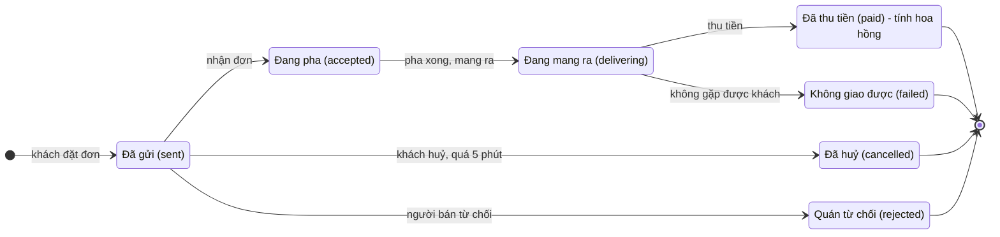

# PRD: Gọi nước tại bàn qua mã QR

*Cập nhật: 01/10/2026*

## Bối cảnh và vấn đề

Bản đầu tiên cho phép khách đang ngồi ăn tại quán đối tác quét mã QR trên bàn để gọi cà phê, người bán mang ra bàn và thu tiền khi giao, cuối kỳ trả quán 15% doanh thu đã thu. Phạm vi là **một người bán**, chạy thử 2 tuần ở **1 quán ăn** gần nơi pha chế, đạt thì mở rộng ra 3–5 quán.

Hiện chưa có công cụ nào cho cách bán này. Nếu khách nhắn tin gọi món, người bán không biết chắc quán và bàn, giờ cao điểm phải vừa pha vừa trả lời tay, còn hoa hồng thì đếm tay nên chủ quán không có căn cứ để tin.

Rủi ro lớn nhất không nằm ở công nghệ:

- **Thời gian giao:** khách chỉ ngồi 15–30 phút cho một bữa (giả định, cần đo).
- **Tỷ lệ khách quét mã và đặt:** chưa có số liệu.
- **Sự hợp tác của chủ quán:** 15% trên vài ly mỗi bữa là khoản nhỏ, một lần khách phàn nàn là quán có thể cất mã.

Vì vậy sản phẩm phải gọn, đo được ba rủi ro này, và không bắt ai cài app.

## Mục tiêu

Bản đầu tiên thành công khi cả bốn điều sau đúng trong 2 tuần chạy thử:


| #   | Mục tiêu                                     | Cho ai              | Mục tiêu đo                                                                                                                                   |
| --- | -------------------------------------------- | ------------------- | --------------------------------------------------------------------------------------------------------------------------------------------- |
| G1  | Khách đặt nước nhanh, không rào cản          | Khách               | Từ lúc mở trang tới lúc đặt xong ≤ 60 giây (trung vị). Không cài app, không đăng nhập; chỉ nhập số điện thoại để nhận trạng thái đơn qua Zalo |
| G2  | Nước tới bàn trước khi khách ăn xong         | Khách, người bán    | Người bán nhận đơn trong ≤ 60 giây; ≥ 80% đơn tới bàn trong ≤ 10 phút kể từ lúc đặt                                                           |
| G3  | Hoa hồng minh bạch, không cần cãi nhau       | Chủ quán, người bán | 100% đơn gắn đúng quán và bàn; báo cáo theo quán khớp với số đơn đã thu tiền, không chỉnh tay                                                 |
| G4  | Có đủ số liệu để quyết định đi tiếp hay dừng | Người bán           | Đo được phễu mở trang → đặt → giao thành công theo từng quán, từng ngày                                                                       |


G4 là mục tiêu kinh doanh quan trọng nhất của giai đoạn này: sản phẩm tồn tại trước hết để trả lời câu hỏi "mô hình này có sống được không".

## Ngoài phạm vi

Những thứ dưới đây cố ý không làm ở bản đầu tiên. Muốn thêm thứ gì vào phạm vi thì phải bỏ ra một thứ tương đương hoặc lùi lịch.


| Không làm                                          | Lý do                                                                                                                                          |
| -------------------------------------------------- | ---------------------------------------------------------------------------------------------------------------------------------------------- |
| App cài đặt cho khách                              | Khách ngồi ăn 15–30 phút không tải app để gọi một ly nước; tỷ lệ đặt sẽ gần bằng 0                                                             |
| Zalo Mini App                                      | Cần Zalo OA đã xác thực bằng giấy phép hộ kinh doanh và chờ Zalo duyệt; lợi ích chính là lấy số điện thoại khách, nay đã có qua ô nhập khi đặt |
| Thanh toán online trước khi giao                   | Trả khi nhận đã đủ; bỏ được tích hợp cổng thanh toán, hoàn tiền và tranh chấp                                                                  |
| Tài khoản khách, tích điểm, khuyến mãi             | Chỉ có giá trị khi đã có khách quen; chưa có dữ liệu để biết                                                                                   |
| Giao ra ngoài quán đối tác, giao tận nhà           | Bài toán khác, cạnh tranh trực tiếp với app giao đồ ăn                                                                                         |
| Tin trạng thái cho khách qua ZNS (Zalo OA)         | Cần OA đã xác thực và phí mỗi tin; bản đầu gửi qua tài khoản Zalo cá nhân (P0-11)                                                              |
| Nhiều người bán, bán thành phần mềm cho người khác | Đang giải bài toán cho đúng một người bán                                                                                                      |


## Người dùng và câu chuyện người dùng

Có ba nhóm người dùng, xếp theo mức độ dùng sản phẩm. Câu chuyện trong mỗi nhóm xếp theo độ ưu tiên.

**Khách tại bàn** — đang ăn ở quán đối tác, dùng điện thoại của mình, quét bằng camera hoặc Zalo.

1. Là khách đang ăn, tôi muốn quét mã trên bàn và thấy ngay menu nước để gọi mà không phải cài gì hay đăng nhập.
2. Là khách, tôi muốn biết trước khoảng bao lâu nước tới để quyết định có nên gọi không.
3. Là khách, tôi muốn chọn độ ngọt và lượng đá để ly nước đúng khẩu vị.
4. Là khách, tôi muốn thấy quán đã nhận đơn chưa và khi nào nước đang được mang ra, để không phải ngồi đoán.
5. Là khách, tôi muốn nhận tin Zalo báo trạng thái đơn, để không phải giữ trang web mở trong lúc ăn.
6. Là khách, khi quán chưa xác nhận sau 1 phút, tôi muốn được báo và được chọn chờ thêm hoặc huỷ, để không chờ vô vọng.
7. Là khách, tôi muốn trả tiền mặt hoặc chuyển khoản khi nhận nước, để không phải trả trước cho một đơn chưa chắc tới.
8. Là khách, khi món đã hết hoặc đang ngoài giờ bán, tôi muốn biết ngay trên menu thay vì đặt xong mới bị từ chối.

**Người bán** — chủ quán cà phê và người mang nước ra bàn, dùng điện thoại tại quầy pha.

1. Là người bán, tôi muốn nhận chuông báo ngay khi có đơn, kèm tên quán, số bàn, món và tổng tiền, để pha ngay.
2. Là người bán, tôi muốn nhận hoặc từ chối đơn bằng một chạm, để khách biết ngay.
3. Là người bán, tôi muốn đánh dấu đang mang ra và đã thu tiền (tiền mặt hoặc chuyển khoản), để khách thấy trạng thái và đơn được tính đúng.
4. Là người bán, khi đến bàn không gặp khách, tôi muốn đóng đơn là không giao được, để đơn đó không bị tính hoa hồng.
5. Là người bán, tôi muốn báo hết một món trong vài giây, để khách không đặt món không còn.
6. Là người bán, tôi muốn tạm ngưng nhận đơn khi quá tải, để không nhận đơn mà không giao kịp.
7. Là người bán, tôi muốn xem hoa hồng phải trả theo từng quán, từng ngày, để trả đúng và nhanh.

**Chủ quán đối tác** — không dùng hệ thống hằng ngày, chỉ nhận báo cáo.

1. Là chủ quán, tôi muốn nhận báo cáo số đơn và hoa hồng của quán mình mỗi ngày mà không phải hỏi, để tin rằng con số là đúng.
2. Là chủ quán, tôi muốn khách biết rõ nước là của người bán khác, để khách không hỏi nhân viên của tôi.
3. Là chủ quán, tôi muốn món của tôi không bị bán trùng, để không mất doanh thu đồ uống của quán.

## Giải pháp đã chốt và luồng chính

Khách dùng **trang web** mở thẳng từ mã QR, nhập số điện thoại khi đặt để nhận trạng thái đơn qua **Zalo**; người bán nhận báo đơn mới qua **Zalo** (tin tự động từ một tài khoản Zalo cá nhân) và xử lý đơn trên **màn người bán (web)**, cùng chỗ với quản lý menu, mã QR và báo cáo. Không ai phải cài app riêng.


| Thành phần                      | Ai dùng   | Vai trò                                                                                                                                   |
| ------------------------------- | --------- | ----------------------------------------------------------------------------------------------------------------------------------------- |
| Mã QR trên bàn                  | Khách     | Chứa link cố định `https://<tên miền>/t/<mã>`; mã ngẫu nhiên gắn với một quán và một bàn                                                  |
| Trang đặt nước (web)            | Khách     | Menu theo quán, giỏ, nhập số điện thoại, đặt đơn, theo dõi trạng thái. Chạy trong Safari, Chrome và trình duyệt nhúng của Zalo            |
| Tin trạng thái qua Zalo cá nhân | Khách     | Báo khi quán nhận đơn, đang mang ra, đã thanh toán hoặc đơn bị huỷ; gửi từ cùng tài khoản Zalo gửi tin của người bán                      |
| Tin báo đơn qua Zalo cá nhân    | Người bán | Báo đơn mới kèm link mở đúng đơn; gửi qua phần kết nối Zalo cá nhân tự xây (không chính thức), chấp nhận rủi ro tài khoản gửi tin bị khoá |
| Màn người bán (web)             | Người bán | Xử lý đơn có chuông báo (nhận, từ chối, mang ra, thu tiền); bật/tắt món, tạm ngưng nhận đơn, quản lý quán, bàn, mã QR, báo cáo hoa hồng   |
| Báo cáo cho chủ quán            | Chủ quán  | Bản tóm tắt theo ngày, người bán gửi qua Zalo (bản đầu gửi tay)                                                                           |


Luồng chính khi mọi thứ suôn sẻ:

1. Khách quét mã trên bàn, điện thoại mở trang đặt nước của đúng quán và bàn đó.
2. Trang hiện tên bàn, tên quán, thời gian giao dự kiến và cách trả tiền, rồi tới menu đã lọc theo quán.
3. Khách chọn món, độ ngọt, lượng đá, số ly, ghi chú, nhập số điện thoại, rồi bấm "Đặt nước".
4. Hệ thống tạo đơn, báo trên màn người bán kèm chuông và gửi tin Zalo cho người bán.
5. Người bán bấm "Nhận đơn" trên màn người bán; trang của khách chuyển sang "Quán đang pha" và khách nhận tin Zalo.
6. Pha xong, người bán bấm "Mang ra bàn"; trang của khách chuyển sang "Đang mang ra" và khách nhận tin Zalo.
7. Tại bàn, khách trả tiền mặt hoặc quét mã chuyển khoản có sẵn số tiền; người bán bấm "Đã thu tiền".
8. Đơn được tính vào báo cáo hoa hồng của quán; trang của khách hiện "Đã thanh toán" và khách nhận tin Zalo xác nhận.

Các nhánh khác (từ chối, khách huỷ, quá hạn, không gặp khách) nằm ở phần Quy tắc nghiệp vụ. Bản mẫu tương tác `goi-nuoc-tai-ban.html` minh hoạ luồng này; bản thật giữ màn người bán trên web như bản mẫu và thêm tin báo đơn mới qua Zalo.

## Yêu cầu bắt buộc (P0)

Thiếu bất kỳ mục nào dưới đây thì không chạy thử được. Mỗi mục có tiêu chí nghiệm thu kiểm thử được.

### P0-1. Mã QR theo bàn

Mỗi bàn có một mã QR chứa link cố định trên tên miền riêng của người bán; mã ngẫu nhiên trong link được máy chủ tra ra quán và bàn.

- \[ \] Link có dạng `https://<tên miền>/t/<mã>`, mã gồm ít nhất 8 ký tự ngẫu nhiên, không chứa tên quán hay số bàn.
- \[ \] Người bán tạo được mã cho một bàn mới, tải ảnh mã để in, kèm tên quán và số bàn in bằng chữ cạnh mã.
- \[ \] Người bán thu hồi được một mã; quét mã đã thu hồi hiện "Mã này không còn dùng", không cho đặt.
- \[ \] Đổi giao diện hay hạ tầng không làm đổi link đã in.

### P0-2. Trang menu theo quán

- \[ \] Quét mã hợp lệ thì mở trang có tên bàn, tên quán, thời gian giao dự kiến và dòng "Trả tiền khi nhận, tiền mặt hoặc chuyển khoản".
- \[ \] Món nằm trong danh sách ẩn của quán đó không xuất hiện.
- \[ \] Món đang hết hiện mờ kèm chữ "Hết món", không chọn được.
- \[ \] Ngoài giờ bán của quán, hoặc khi người bán tạm ngưng nhận đơn: vẫn xem được menu, nút đặt bị khoá kèm lý do.
- \[ \] Cuối trang ghi rõ đồ uống do người bán pha, không phải đồ của quán.
- \[ \] Mỗi lần mở trang được ghi nhận theo bàn và theo ngày (phục vụ G4), không lưu thông tin nhận dạng cá nhân.

### P0-3. Chọn món và giỏ

- \[ \] Mỗi món chọn được độ ngọt (Ít ngọt / Vừa / Ngọt) và đá (Không đá / Ít đá / Bình thường) nếu món có tuỳ chọn đó; mặc định là Vừa và Bình thường.
- \[ \] Số ly từ 1 đến 20 mỗi dòng; cùng món, cùng tuỳ chọn thì gộp dòng.
- \[ \] Ghi chú tối đa 200 ký tự, không bắt buộc.
- \[ \] Giỏ hiện tổng tiền; món vừa hết khi đang trong giỏ thì bị đánh dấu và chặn đặt cho tới khi bỏ món đó.

### P0-4. Đặt đơn không bị trùng

- **Given** khách bấm "Đặt nước" nhiều lần hoặc mạng gửi lại yêu cầu
- **When** máy chủ nhận nhiều yêu cầu cùng một mã chống trùng
- **Then** chỉ một đơn được tạo, các yêu cầu sau nhận lại đúng đơn đó

Thêm:

- \[ \] Đơn ghi cứng quán, bàn, tên món và giá tại thời điểm đặt; sửa menu hay chuyển mã sang bàn khác sau đó không làm đổi đơn cũ.
- \[ \] Máy chủ từ chối đơn khi mã đã thu hồi, ngoài giờ bán, đang tạm ngưng, hoặc có món đã hết, kèm thông báo dễ hiểu.

### P0-5. Báo đơn mới cho người bán qua Zalo

- \[ \] Trong vòng 10 giây sau khi đơn được tạo (mục tiêu, cần đo thực tế), hệ thống gửi một tin Zalo từ tài khoản Zalo cá nhân dùng riêng để gửi tin, tới Zalo của người bán (hoặc một nhóm Zalo gồm người bán và người giao). Tin gồm: mã đơn, quán, bàn, tóm tắt món, tổng tiền và link mở đúng đơn trên màn người bán (web).
- \[ \] Mọi thao tác nhận, từ chối, mang ra, thu tiền làm trên màn người bán; tin Zalo chỉ để báo.
- \[ \] Màn người bán kêu chuông khi có đơn mới, dùng được khi để mở trên một máy cố định ở quầy pha. Đây là kênh chính; tin Zalo báo cho người bán khi họ không nhìn màn hình.
- \[ \] Gửi tin Zalo thất bại thì thử lại; sau 3 lần vẫn lỗi, hoặc khi phiên đăng nhập Zalo hết hạn, màn người bán hiện cảnh báo đỏ để người bán biết lúc đó chỉ còn chuông báo. Khi phiên hết hạn, cảnh báo ghi rõ "Phiên Zalo đã hết hạn — khách không nhận được tin trạng thái đơn. Vào Cài đặt để quét lại mã QR." kèm link tới Cài đặt; chưa cấu hình hoặc chưa kết nối Zalo thì không đỏ.
- \[ \] Tài khoản gửi tin là một tài khoản Zalo phụ, không phải tài khoản chính của người bán, để nếu bị khoá thì không mất danh bạ và tin nhắn với khách quen.

> **Trạng thái hiện tại:** tin báo đơn mới cho người bán qua Zalo **chưa** làm; người bán nhận đơn bằng chuông và màn người bán. Tài khoản Zalo kết nối trong Cài đặt (P0-11) hiện chỉ gửi tin trạng thái cho khách.

> **Rủi ro đã chấp nhận:** gửi tin tự động từ Zalo cá nhân là cách không chính thức, trái điều khoản của Zalo. Tài khoản gửi tin có thể bị khoá, và phần kết nối tự xây có thể phải sửa khi Zalo cập nhật. Khi đó hệ thống vẫn chạy bằng chuông trên màn người bán; chuyển sang Zalo OA khi người bán có giấy phép hộ kinh doanh. Gửi tin cho khách (P0-11) là nhắn tới người lạ, nên rủi ro tài khoản gửi tin bị Zalo hạn chế hoặc khoá cao hơn so với chỉ nhắn cho người bán.

### P0-6. Người bán cập nhật trạng thái đơn

- \[ \] Trên màn người bán, mỗi đơn có nút theo từng bước: Đã gửi → "Nhận đơn" / "Từ chối"; Đang pha → "Mang ra bàn"; Đang mang ra → "Thu tiền mặt" / "Chuyển khoản" / "Không gặp khách".
- \[ \] Chỉ cho phép các chuyển trạng thái nêu ở phần Quy tắc nghiệp vụ; hai người bấm cùng lúc thì người sau thấy đơn đã đổi trạng thái, không bị ghi đè.
- \[ \] Mỗi lần chuyển trạng thái lưu thời điểm và người bấm.

### P0-7. Trang trạng thái cho khách

- \[ \] Sau khi đặt, khách thấy mã đơn, danh sách món, tổng tiền và thanh 4 bước: Đã gửi, Quán nhận, Mang ra, Đã nhận nước.
- \[ \] Trạng thái tự cập nhật trong vòng 10 giây sau khi người bán bấm, không cần tải lại trang.
- \[ \] Đơn ở trạng thái Đã gửi quá 60 giây: hiện thông báo quán chưa xác nhận, kèm nút "Chờ thêm" và "Huỷ đơn".
- \[ \] Khách chỉ huỷ được khi đơn còn ở trạng thái Đã gửi.
- \[ \] Khách đóng trang rồi quét lại mã cùng bàn trong cùng ngày thì vẫn thấy lối vào đơn đang chạy của mình trên cùng thiết bị.

### P0-8. Thanh toán khi nhận

- \[ \] Với lựa chọn chuyển khoản, màn người bán hiện mã VietQR có sẵn số tiền và nội dung là mã đơn, để đưa khách quét.
- \[ \] Người bán xác nhận đã nhận tiền bằng tay; hệ thống ghi phương thức thanh toán của đơn.

### P0-9. Báo cáo hoa hồng

- \[ \] Trang quản trị hiện theo từng quán và tổng: số đơn đã thu tiền, doanh thu, số đơn không giao được, hoa hồng, chọn được theo ngày, khoảng ngày, hoặc theo kỳ trả hoa hồng của quán (tuần hoặc tháng).
- \[ \] Hoa hồng chỉ tính trên đơn ở trạng thái Đã thu tiền, theo tỷ lệ riêng của từng quán (mặc định 15%).
- \[ \] Đơn đã thu tiền không sửa và không xoá được; muốn điều chỉnh thì tạo bản ghi điều chỉnh có lý do.
- \[ \] Xuất được bản tóm tắt theo một quán để gửi chủ quán (ảnh hoặc văn bản để dán vào Zalo).

### P0-10. Trang quản trị cho người bán

- \[ \] Đăng nhập bằng mật khẩu; chỉ người bán dùng được.
- \[ \] Bật/tắt từng món; thay đổi hiện trên menu của khách trong vòng 10 giây.
- \[ \] Một công tắc "Tạm ngưng nhận đơn" áp dụng cho mọi quán.
- \[ \] Quản lý quán (tên, giờ bán, tỷ lệ hoa hồng, kỳ trả hoa hồng theo tuần hoặc tháng, danh sách món ẩn), bàn và mã QR.

### P0-11. Số điện thoại và tin trạng thái cho khách

- \[ \] Giỏ có ô số điện thoại không bắt buộc. Bỏ trống thì vẫn đặt được và không gửi tin trạng thái; nhập thì phải đúng định dạng số di động Việt Nam (10 chữ số, bắt đầu bằng 0), sai thì báo lỗi ngay dưới ô và không cho đặt.
- \[ \] Dưới ô ghi rõ: "Nhập để nhận tin trạng thái đơn qua Zalo. Bỏ trống thì không nhận tin." Nhập số và bấm "Đặt nước" là đồng ý với mục đích này.
- \[ \] Trình duyệt nhớ số đã nhập để lần sau điền sẵn; khách sửa được.
- \[ \] Khi đơn chuyển sang Đang pha, Đang mang ra, Đã thu tiền, Quán từ chối hoặc Đã huỷ do quá hạn, hệ thống gửi tin Zalo tới số này từ tài khoản gửi tin. Tin gồm: mã đơn, quán, bàn, trạng thái mới, tổng tiền.
- \[ \] Người bán kết nối tài khoản gửi tin bằng cách quét mã QR trong trang Cài đặt (đồng ý rủi ro trước khi quét), xem trạng thái kết nối, ngắt kết nối và quét lại khi phiên hết hạn.
- \[ \] Gửi lỗi (số không dùng Zalo, khách chặn tin người lạ, tài khoản gửi tin bị hạn chế) thì ghi log và bỏ qua; đơn vẫn chạy bình thường, trang trạng thái trên web vẫn là kênh chính.
- \[ \] Màn người bán hiện số điện thoại của khách trên từng đơn, để gọi khi đến bàn mà không tìm thấy khách.
- \[ \] Số điện thoại không hiện trong báo cáo gửi chủ quán và không xuất ra ngoài hệ thống.

## Yêu cầu nên có (P1) và để sau (P2)

P1 là những thứ làm ngay sau chạy thử nếu số liệu cho phép đi tiếp. P2 không làm bây giờ, nhưng thiết kế dữ liệu và API phải không chặn đường làm chúng sau này.


| Mã   | Yêu cầu                                                                              | Vì sao chưa vào P0                                    | Tiêu chí khi làm                                                                 |
| ---- | ------------------------------------------------------------------------------------ | ----------------------------------------------------- | -------------------------------------------------------------------------------- |
| P1-1 | Thời gian giao dự kiến tính theo số đơn đang chờ thay vì con số cố định              | Cần số liệu chạy thử để đặt công thức                 | Sai số so với thực tế ≤ 3 phút ở ≥ 80% đơn                                       |
| P1-2 | Tự xác nhận chuyển khoản qua dịch vụ đọc biến động số dư tài khoản                   | Xác nhận tay đủ dùng với vài chục đơn/ngày            | Đơn chuyển sang Đã thu tiền trong ≤ 30 giây khi tiền về đúng số và đúng nội dung |
| P1-3 | Tự gửi báo cáo cuối ngày cho chủ quán                                                | Bản đầu gửi tay bằng ảnh chụp là đủ                   | Chủ quán nhận lúc giờ cố định mỗi ngày, không cần người bán thao tác             |
| P1-4 | Giới hạn số đơn đang mở và tự tạm ngưng khi quá tải                                  | Chưa biết công suất pha thực tế                       | Khi số đơn Đã gửi + Đang pha vượt ngưỡng, menu khoá nút đặt và hiện lý do        |
| P1-5 | Giới hạn số đơn theo thiết bị trong một khoảng thời gian                             | Đơn ảo hiếm khi đã trả tiền khi nhận                  | Chặn quá 3 đơn đang mở trên một thiết bị                                         |
| P1-6 | Thông báo đẩy của trình duyệt cho màn người bán, dự phòng khi tin Zalo chậm hoặc lỗi | Chuông trên màn người bán và tin Zalo đủ cho chạy thử | Điện thoại người bán tắt màn hình vẫn nhận được báo đơn                          |
| P2-1 | Tài khoản khách, tích điểm, khách quen                                               | Chưa có khách quen để phục vụ                         | Đơn có trường khách tuỳ chọn, để trống không ảnh hưởng luồng                     |
| P2-2 | Zalo Mini App                                                                        | Thủ tục OA và duyệt                                   | API đặt đơn dùng chung được cho mọi giao diện                                    |
| P2-3 | Nhiều điểm pha hoặc nhiều người bán                                                  | Đang phục vụ đúng một người bán                       | Mọi bảng có thể thêm khoá người bán mà không đổi cấu trúc đơn                    |
| P2-4 | Khuyến mãi, combo với món của quán                                                   | Phải thoả thuận lại cách tính hoa hồng                | Đơn lưu giá gốc và số tiền giảm tách riêng                                       |


Khi người bán có giấy phép hộ kinh doanh, chuyển kênh báo đơn từ Zalo cá nhân sang Zalo OA để hết rủi ro bị khoá tài khoản; chỉ thay dịch vụ gửi tin, luồng xử lý đơn trên màn người bán giữ nguyên.

## Quy tắc nghiệp vụ

Một đơn chỉ được tính hoa hồng khi đã thu được tiền; mọi nhánh còn lại đều đóng đơn mà không tính.



Hàng trên là luồng chính; ba trạng thái `cancelled`, `rejected`, `failed` là các cách đơn bị đóng mà không thu tiền, và không có đường quay lại từ chúng.

**Trạng thái đơn**


| Trạng thái      | Mã           | Ai chuyển tới                                 | Từ trạng thái | Tính hoa hồng |
| --------------- | ------------ | --------------------------------------------- | ------------- | ------------- |
| Đã gửi          | `sent`       | Khách đặt đơn                                 | —             | Không         |
| Đang pha        | `accepted`   | Người bán                                     | `sent`        | Không         |
| Đang mang ra    | `delivering` | Người bán                                     | `accepted`    | Không         |
| Đã thu tiền     | `paid`       | Người bán                                     | `delivering`  | **Có**        |
| Quán từ chối    | `rejected`   | Người bán                                     | `sent`        | Không         |
| Đã huỷ          | `cancelled`  | Khách, hoặc hệ thống khi quá 5 phút chưa nhận | `sent`        | Không         |
| Không giao được | `failed`     | Người bán                                     | `delivering`  | Không         |


**Quy tắc thời gian**

- Đơn ở `sent` quá 60 giây: trang của khách hiện cảnh báo, khách chọn chờ thêm hoặc huỷ.
- Đơn ở `sent` quá 5 phút: hệ thống tự chuyển sang `cancelled` với lý do "quá hạn", và báo trên màn người bán.
- Thời gian giao dự kiến hiển thị cho khách: cố định 7 phút cho mọi quán ở bản đầu (P1-1 sẽ thay bằng công thức).

**Hoa hồng và đối soát**

- Hoa hồng của một quán trong kỳ = tỷ lệ của quán × tổng tiền các đơn `paid` của quán trong kỳ, làm tròn tới đồng.
- Tỷ lệ mặc định 15%, lưu riêng cho từng quán; đơn lưu tỷ lệ tại thời điểm thu tiền để đổi tỷ lệ sau này không làm sai số cũ.
- Người bán chịu toàn bộ chi phí của đơn `failed`, `rejected`, `cancelled`.
- Đơn `paid` không sửa, không xoá. Sai sót được xử lý bằng bản ghi điều chỉnh (số tiền âm hoặc dương, lý do, người tạo), hiện riêng trong báo cáo.

**Thoả thuận với chủ quán** (cần chốt trước khi đặt mã)

- Danh sách món không bán ở quán đó, vì quán tự bán.
- Chân đặt mã ghi rõ tên người bán và "giao tới bàn, thanh toán khi nhận".
- Kỳ trả hoa hồng theo tuần hoặc theo tháng (cấu hình được cho từng quán) và cách trả.
- Chủ quán nhận báo cáo hằng ngày; mọi thắc mắc về chất lượng đồ uống do người bán chịu.

## Yêu cầu phi chức năng và thiết kế kỹ thuật

Hệ thống nhỏ, một máy chủ là đủ; ưu tiên ít thành phần để một người vận hành được.

**Yêu cầu phi chức năng**


| Hạng mục                             | Yêu cầu                                                                                                                                                                                                                                                                    |
| ------------------------------------ | -------------------------------------------------------------------------------------------------------------------------------------------------------------------------------------------------------------------------------------------------------------------------- |
| Tốc độ mở trang menu                 | ≤ 2 giây trên mạng 4G yếu; trang nhẹ, không dùng framework nặng phía khách                                                                                                                                                                                                 |
| Độ trễ báo đơn cho người bán         | ≤ 5 giây trên màn người bán; tin Zalo ≤ 10 giây (mục tiêu, cần đo thực tế)                                                                                                                                                                                                 |
| Độ trễ cập nhật trạng thái cho khách | ≤ 10 giây (trang hỏi lại máy chủ mỗi khoảng 5 giây)                                                                                                                                                                                                                        |
| Trình duyệt hỗ trợ                   | Safari iOS, Chrome Android, trình duyệt nhúng của Zalo trên cả hai hệ điều hành                                                                                                                                                                                            |
| Sẵn sàng                             | Chạy ổn định trong giờ bán; có cảnh báo cho người vận hành khi máy chủ hoặc dịch vụ gửi tin ngừng                                                                                                                                                                          |
| Bảo mật                              | Mã QR không đoán được; giới hạn tần suất gọi API theo thiết bị; trang quản trị có đăng nhập; phiên đăng nhập của tài khoản Zalo gửi tin lưu bí mật, không nằm trong mã nguồn                                                                                               |
| Dữ liệu cá nhân                      | Chỉ thu số điện thoại của khách, dùng duy nhất để báo trạng thái đơn và để người bán gọi khi không tìm thấy khách; không thu tên hay vị trí. Số điện thoại bị xoá khỏi đơn sau 90 ngày (đề xuất). Phải tuân thủ quy định bảo vệ dữ liệu cá nhân hiện hành (xem Câu hỏi mở) |
| Sao lưu                              | Sao lưu cơ sở dữ liệu hằng ngày ra nơi khác máy chủ; dữ liệu đơn giữ ít nhất 12 tháng để đối soát                                                                                                                                                                          |
| Tên miền                             | Tên miền riêng của người bán, đăng ký dài hạn; link trên mã QR không bao giờ đổi                                                                                                                                                                                           |


**Kiến trúc đề xuất** (kỹ thuật xác nhận lại)

- Một dịch vụ backend viết bằng Go: API cho trang khách, màn người bán và quản trị, tác vụ định kỳ (tự huỷ đơn quá hạn).
- Trang khách và trang quản trị: HTML render phía máy chủ kèm một ít TypeScript, phục vụ cùng dịch vụ.
- Cơ sở dữ liệu: PostgreSQL, hoặc SQLite nếu chạy một máy chủ duy nhất.
- Gửi tin Zalo: một dịch vụ nhỏ viết bằng TypeScript chạy cạnh backend, tự xây phần kết nối Zalo cá nhân, nhận sự kiện đơn mới từ backend rồi gửi tin. Tách riêng để khi phần kết nối hỏng hoặc tài khoản bị khoá, phần còn lại vẫn chạy và chỉ cần thay dịch vụ này khi chuyển sang Zalo OA.
- Mã VietQR tạo theo chuẩn mã QR thanh toán, không cần tích hợp ngân hàng.

**Mô hình dữ liệu tối thiểu**

```sql
partners        (id, name, commission_rate, payout_period, open_hours, active)   -- payout_period: week | month
partner_hidden  (partner_id, product_id)
qr_codes        (token PK, partner_id, table_label, active, created_at, revoked_at)
products        (id, name, price, image_url, has_sweet, has_ice, available, sort)
orders          (id, code, qr_token, partner_id, table_label,      -- ghi cứng lúc tạo
                 items JSON, note, total, commission_rate,
                 status, cancel_reason, payment_method,
                 created_at, accepted_at, delivering_at, paid_at, closed_at,
                 customer_phone, client_id, idempotency_key UNIQUE)
order_events    (order_id, from_status, to_status, actor, at)
adjustments     (id, partner_id, order_id NULL, amount, reason, created_by, created_at)
page_views      (qr_token, day, client_id)                          -- phục vụ phễu G4
settings        (accepting_orders, eta_minutes)

```

**API**

```
GET  /t/{token}                          → trang menu (HTML) + dữ liệu: quán, bàn, đang nhận đơn?, ETA, menu
POST /api/t/{token}/orders               → { order_id, code }     header: Idempotency-Key
GET  /api/orders/{id}                    → { status, items, total, updated_at }
POST /api/orders/{id}/cancel             → chỉ khi status = sent
POST /api/seller/orders/{id}/transition  → người bán đổi trạng thái đơn (cần đăng nhập)

```

**Chi phí hạ tầng ước tính**


| Hạng mục                                                     | Chi phí                                                                                                               |
| ------------------------------------------------------------ | --------------------------------------------------------------------------------------------------------------------- |
| Tên miền `.com`                                              | \~110k năm đầu, \~280k/năm từ năm thứ hai                                                                             |
| VPS Việt Nam 2 GB RAM (chạy chung ứng dụng và cơ sở dữ liệu) | \~140k/tháng (\~1,68 triệu/năm)                                                                                       |
| **Tổng**                                                     | **\~1,8 triệu năm đầu, \~1,96 triệu/năm sau đó** (thấp nhất \~1,1 triệu năm đầu nếu dùng gói khuyến mãi trả theo năm) |


## Chỉ số thành công và kế hoạch chạy thử

Chạy thử 2 tuần ở 1 quán, chỉ bữa trưa (11:00–13:30). Hết 2 tuần, quyết định đi tiếp, sửa rồi chạy lại, hay dừng mô hình QR, theo bảng dưới.


| Chỉ số                                  | Cách đo                                                    | Đi tiếp khi         | Dừng khi                       |
| --------------------------------------- | ---------------------------------------------------------- | ------------------- | ------------------------------ |
| Đơn đã thu tiền mỗi quán mỗi bữa trưa   | Đơn `paid` theo quán, theo ngày                            | ≥ 3 đơn             | ≤ 2 đơn trung bình suốt 2 tuần |
| Tỷ lệ đặt trên lượt mở trang            | Đơn tạo ra / số thiết bị mở trang, theo bàn                | ≥ 15%               | &lt; 5%                        |
| Tỷ lệ khách quét mã                     | Thiết bị mở trang / số khách của quán (chủ quán ước lượng) | ≥ 5%                | &lt; 2%                        |
| Thời gian người bán nhận đơn            | `accepted_at` − `created_at`, trung vị                     | ≤ 60 giây           | —                              |
| Thời gian tới bàn                       | `delivering_at` − `created_at` cộng thời gian đi bộ đo tay | ≥ 80% đơn ≤ 10 phút | &gt; 20% đơn quá 10 phút       |
| Tỷ lệ giao thành công                   | `paid` / (`paid` + `failed`)                               | ≥ 90%               | &lt; 80%                       |
| Nhân viên quán bị khách hỏi về đơn nước | Chủ quán ghi lại, cuối tuần hỏi                            | ≤ 2 lần/tuần        | Chủ quán muốn cất mã           |


**Chỉ số theo dõi dài hơn** (sau khi đi tiếp, đo theo tháng):

- Số quán còn giữ mã sau 4 tuần.
- Doanh thu ròng sau hoa hồng của kênh này so với chi phí nhân công giao.
- Tỷ lệ khách đặt lại (cùng thiết bị, khác ngày).

## Câu hỏi mở

Còn bốn câu hỏi mở; chỉ câu đầu chặn việc bắt đầu.


| Câu hỏi                                                                                                                              | Ai trả lời | Chặn?                                         |
| ------------------------------------------------------------------------------------------------------------------------------------ | ---------- | --------------------------------------------- |
| Quán nào chạy thử trước, cách chỗ pha bao xa, quán đó tự bán đồ uống gì (để lập danh sách món ẩn)? 3–5 quán mở rộng sau là quán nào? | Người bán  | Có (quán chạy thử); không chặn (quán mở rộng) |
| Danh mục món và giá cuối cùng, món nào có tuỳ chọn ngọt và đá?                                                                       | Người bán  | Không (cần trước khi chạy thử)                |
| Doanh thu qua kênh này có phát sinh nghĩa vụ hoá đơn hay thuế gì khác với kênh online hiện tại không?                                | Kế toán    | Không                                         |
| Thu số điện thoại khách cần câu thông báo và thời gian lưu thế nào để đúng quy định bảo vệ dữ liệu cá nhân?                          | Pháp lý    | Không (cần trước khi chạy thử)                |


**Đã chốt**


| Vấn đề                                           | Quyết định                                                                          |
| ------------------------------------------------ | ----------------------------------------------------------------------------------- |
| Công suất pha giờ cao điểm, số người mang ra bàn | Chưa xét ở bản đầu                                                                  |
| Tài khoản Zalo gửi tin và nơi nhận tin           | Người bán cung cấp số điện thoại riêng cho tài khoản gửi tin; không chặn việc xây   |
| Phần kết nối Zalo cá nhân                        | Tự xây, không có rào cản kỹ thuật                                                   |
| Tên miền và tên thương hiệu                      | Cấu hình sau; chỉ cần chốt trước khi in mã QR, vì link trên mã đã in không đổi được |
| Kỳ trả hoa hồng                                  | Theo tuần hoặc theo tháng, cấu hình được cho từng quán                              |
| Người trực khi hệ thống lỗi giờ trưa             | Người bán                                                                           |
| Thời gian giao dự kiến                           | Giữ cố định 7 phút ở bản đầu, không chỉnh theo từng quán                            |


## Lộ trình

Từ lúc chốt PRD tới quyết định đi tiếp mất khoảng 5 tuần. Không có hạn chót cứng từ bên ngoài, nhưng phần gửi tin Zalo cá nhân nên làm và thử đầu tiên trong tuần 1 vì đây là chỗ dễ hỏng nhất; điều duy nhất không được làm là đặt mã lên bàn trước khi thoả thuận với quán được chốt.


| Giai đoạn | Thời gian           | Nội dung                                                    | Cổng để qua giai đoạn sau                                                                                    |
| --------- | ------------------- | ----------------------------------------------------------- | ------------------------------------------------------------------------------------------------------------ |
| Chuẩn bị  | Tuần 0              | Chốt quán và menu; tên miền, in chân mã; ký thoả thuận      | **Cổng 1:** đã chọn quán chạy thử và ký thoả thuận                                                           |
| Xây P0    | Tuần 1–2 (ước tính) | 11 yêu cầu P0; thử trên 3 trình duyệt; kết nối gửi tin Zalo | **Cổng 2:** nghiệm thu đủ P0                                                                                 |
| Chạy thử  | Tuần 3–4            | 1 quán, bữa trưa; đo 7 chỉ số; báo cáo hằng ngày            | **Cổng 3 (đi tiếp hay dừng):** ≥ 3 đơn/quán/bữa trưa; ≥ 80% đơn tới bàn ≤ 10 phút; ≥ 90% đơn giao thành công |
| Mở rộng   | Từ tuần 5           | 3–5 quán; làm P1 theo số liệu                               | —                                                                                                            |


Mỗi giai đoạn chỉ bắt đầu khi qua cổng phía trước nó. Hai tuần xây là ước tính cho một người làm backend Go và TypeScript, kỹ thuật cần xác nhận lại khi bắt đầu xây. Không đạt cổng 3 thì không mở rộng: hoặc sửa điểm yếu nhất rồi chạy thử thêm 2 tuần, hoặc chuyển sang phương án gửi cà phê chai cho quán bán hộ.